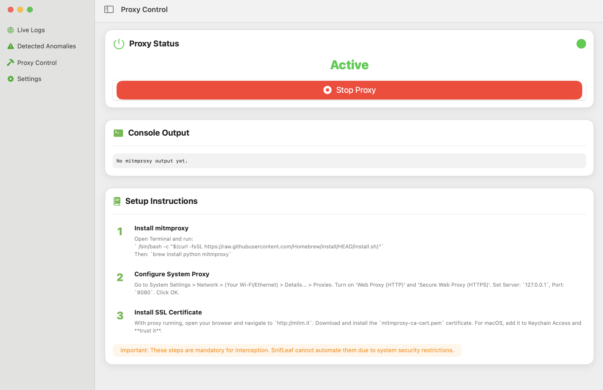
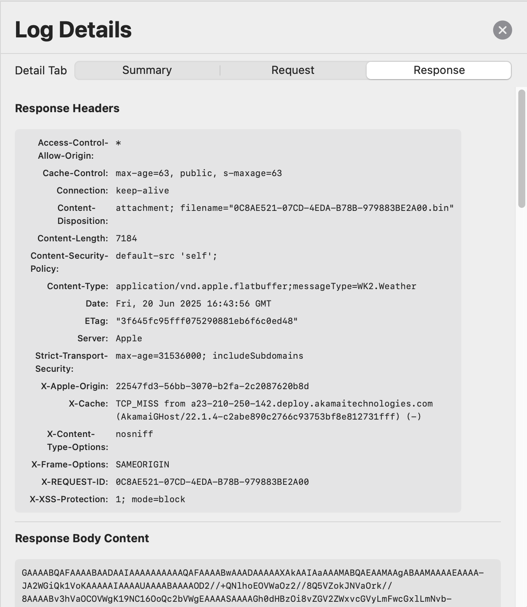
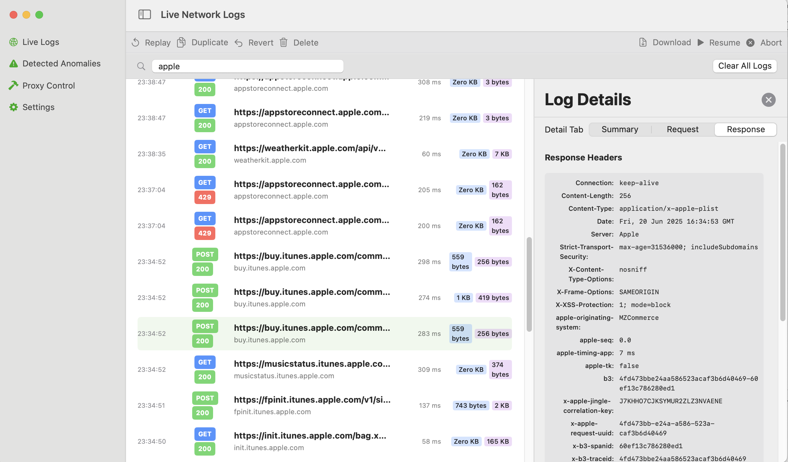
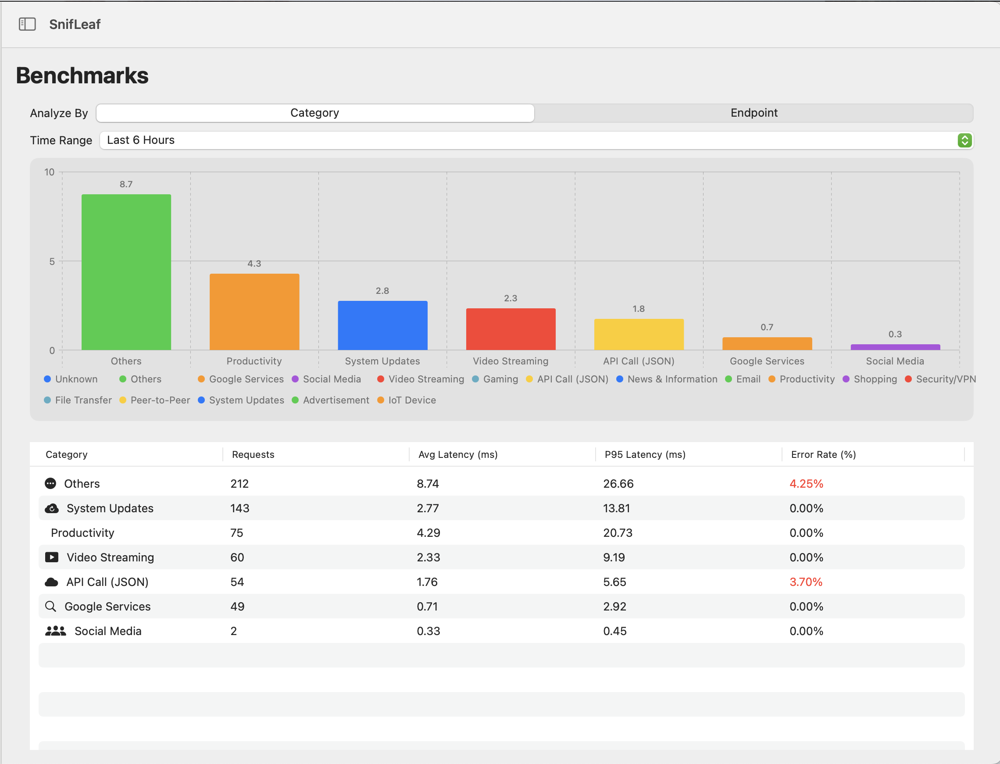

# SnifLeaf – macOS Network Proxy & HTTP Inspector

**SnifLeaf** is a production-grade, native macOS application built with SwiftUI for real-time HTTP/HTTPS traffic capture and analysis. It is engineered with a focus on high-performance data ingestion, modular clean architecture, and ML-powered insights.


---

## Technical Architecture

### Core Pattern: Modular Clean Architecture
The project follows a **layered modular architecture** that separates concerns across independent frameworks, ensuring testability and cross-platform reusability.

* **SnifLeafCore**: The "Source of Truth." Contains core business logic, GRDB data models, and services.
* **Shared**: Infrastructure layer handling process management (`mitmproxy`), networking factories, and utilities.
* **App Targets**: Declarative SwiftUI layers for macOS and iOS that consume the logic via Interactors.

### The Interactor Pattern
To maintain a responsive UI, we utilize the **Interactor Pattern** for business logic:
* **Views**: Purely declarative SwiftUI components.
* **Interactors**: `ObservableObject` classes that coordinate state, handle async data fetching, and manage Combine-based reactive updates.
* **Services**: Low-level logic for specialized tasks like ML anomaly detection and database querying.

---

## Strategic Tech Stack

| Layer | Technology | Rationale |
| :--- | :--- | :--- |
| **Language** | Swift 5.10 | Native performance, memory safety, and modern concurrency. |
| **Persistence** | [GRDB.swift](https://github.com/groue/GRDB.swift) | High-performance SQLite wrapper with type-safe query building and batch-write capabilities. |
| **Concurrency** | Async/Await + Combine | Dual strategy: Async/Await for I/O; Combine for reactive UI state. |
| **Build System** | XcodeGen | Reproducible, version-controlled project structure via `project.yml`. |
| **ML Engine** | CoreML | On-device, real-time anomaly detection using native Apple silicon acceleration. |
| **Proxy Engine** | mitmproxy | Integrated as a robust, industry-standard backbone for traffic interception. |

---

## Highlights

### 1. High-Throughput Data Pipeline
SnifLeaf implements a non-blocking ingestion engine designed to handle thousands of events per minute:
* **Batch Processing**: Log entries are collected in **100-entry buffers** or flushed every 1 second to minimize disk contention.
* **Process Isolation**: The proxy runs as a separate subprocess, communicating via a JSON stream over `stdout` to ensure app stability.

### 2. Persistence
* **Schema Migrations**: A robust versioning system allows for zero-downtime schema updates as the app evolves.
* **Query Optimization**: Strategic indexing on `timestamp`, `host`, and `statusCode` ensures sub-millisecond search performance across large datasets.
* **Pagination**: UI utilizes an infinite scroll strategy (50 items per page) to maintain a constant memory footprint.

### 3. Native ML Integration
* **Anomaly Detection**: Features are extracted from live `LogEntry` data and fed into a `CoreML` pipeline to detect unusual endpoint behavior.
* **Hybrid Training**: Includes a Python-based training service for model generation, while inference remains 100% on-device.

---

## Screenshots

### 🟢 Real-Time Proxy Control  


### 🔍 Log Detail View  


### 📈 Live Traffic Viewer  


### 📈 Benchmarks


---

## Use Cases

| Who?         | Why?                                               |
|--------------|----------------------------------------------------|
| Developers   | Debug REST APIs, inspect network calls             |
| QA Testers   | Verify API usage, generate reports                 |
| Security     | Detect anomalies in traffic                        |
| DevOps       | Lightweight alternative to Wireshark on macOS     |

---

## Quick Start

```bash
git clone https://github.com/hgq287/SnifLeaf.git
open SnifLeaf.xcodeproj
```

- Requires: macOS 15+, Xcode 16+

> `mitmdump` is already bundled and invoked via CLI by the app. No manual installation is needed.

---

## Setup Instructions

1. **Configure System Proxy**

   - System Settings → Network → Your Wi-Fi → Proxy → Enable Web Proxy (127.0.0.1:8080)

2. **Install SSL Certificate**

   - With the proxy running, visit http://mitm.it in your browser
   - Download the certificate and trust it via Keychain Access (macOS only)

> These steps are mandatory for HTTPS traffic interception due to macOS security restrictions.

---

## Contributing

Your contributions are welcome 🙌  
Feel free to:
- Submit issues and feature requests
- Create pull requests
- Improve docs and automation

---

## License

MIT License — see [LICENSE](LICENSE) for full details.

© 2026 [Hg Q.](https://hgq287.github.io)
